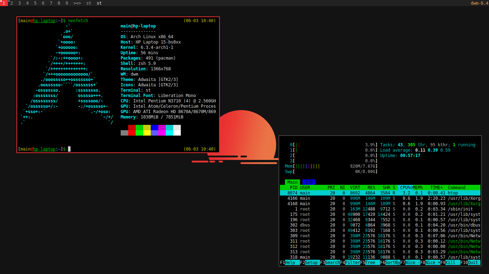

# dwm - dynamic window manager
[dwm](dwm.suckless.org) is an extremely fast, small, and dynamic window manager for X.
It is also has [page](https://wiki.archlinux.org/title/dwm) on Arch Wiki.


## Patches
- [colorbar](https://dwm.suckless.org/patches/colorbar/)
- [remove-border](https://dwm.suckless.org/patches/removeborder/)
- [cool autostart](https://dwm.suckless.org/patches/cool_autostart/)
- [autostart](https://dwm.suckless.org/patches/autostart/)
- [fancybar](https://dwm.suckless.org/patches/fancybar/)
- [pertag](https://dwm.suckless.org/patches/pertag/)
- [systray](https://dwm.suckless.org/patches/systray/)


## Theme
- Pallette: [link](https://colorkit.co/palette/222222-444444-BBBBBB-F5F5F5-EB3232-FFAC4E/)
- Background: [link](https://rare-gallery.com/uploads/posts/924281-minimalism-red-simple-background-digital-art.png)
- Font: `monospace:size=9`


## Requirements
Arch Linux
```
sudo pacman -S base-devel libx11 libxft libxinerama freetype2 fontconfig
```


## Installation
Edit config.def.h to match your local setup (dwm is installed into
the `/usr/local` namespace by default).

Afterwards enter the following command to build and install dwm (if
necessary as root):
```
sudo make clean install
```


## Running dwm
Add the following line to your `.xinitrc` to start dwm using startx:
```
exec dwm
```
